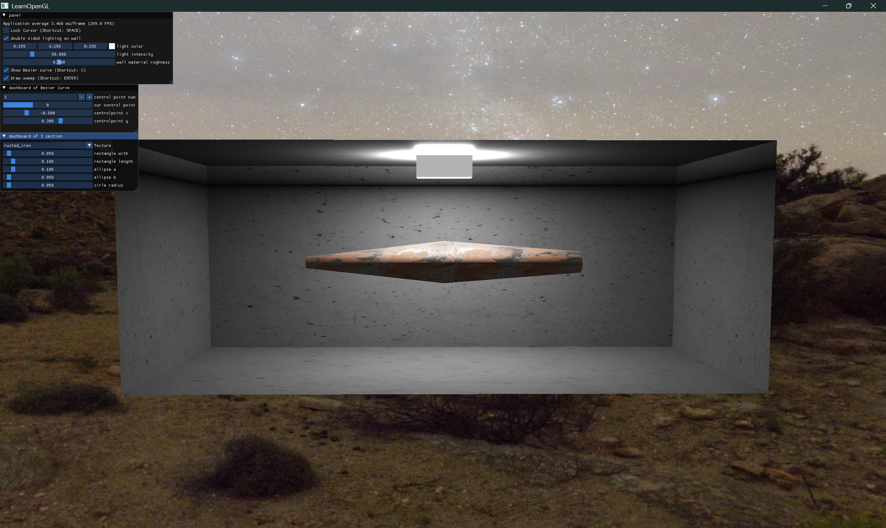

# 大作业项目报告  

[TOC]

## 具体工作

1. **环境搭建**：
   - 使用`GLFW`和`GLAD`搭建`OpenGL`开发环境。
   - 初始化`ImGui`用于图形化用户界面。
2. **区域光的绘制**：
   - 绘制厚度面以及发光面。
   - 跟踪位置变化。
3. **场景墙面绘制**：
   - 加载混凝土纹理。
   - 使用线性变换余弦分布集(`Linearly Transformed Cosines`)的方法从任意凸多面体中渲染区域光。
   - 使用采样`LUT`来构造逆矩阵，并检索几何衰减系数。在物体表面的切空间中构造正交变换矩阵，并计算边缘积分。输入材料和光源的信息等参数。
4. **贝塞尔曲线的绘制**：
   - 设置控制点与采样点。
   - 根据贝塞尔基函数计算采样点坐标。
   - 更新`OpenGL`的缓冲区数据。
5. **扫描曲线拉伸模型的构建**：
   - 定义关键3个截面：矩形、椭圆、圆形的结构体
   - 生成剖面轮廓
   - 沿贝塞尔曲线采样插值
   - 绘制模型
6. **`PBR`纹理材质的应用**
   - 代入`DGF`分布的`Cook-Torrance BRDF`模型
   - 线性空间和HDR渲染

## 技术方案

### 1. 环境搭建

- **`GLFW`和`GLAD`**：用于创建`OpenGL`上下文和加载`OpenGL`函数。
- **`ImGui`**：用于创建用户界面，方便调试和交互。
- **`Assimp`**：用于加载相关模型文件。

### 2. 区域光的绘制

- **绘制出空间中的光源发光面以及厚度面**。
- **设置好矩形区域光的四个角**。
- **创建一个向量来跟踪区域光位置变化**。

### 3. 场景墙面绘制

- **线性变换余弦分布集(`Linearly Transformed Cosines`)**：

  在渲染的时候，需要解决`BRDF`的积分，积分范围是自发光多面体（区域光源）在单位半球面围绕着着色点形成的立体角，以计算出射辐照度(`Irradiance`)。这个出射辐照度将反射回摄像机，从而完成渲染。将线性变换作用于球面分布函数，从而构造一系列可以拟合不同材质和摄像机视角下`BRDF`特性的球面分布函数。`LTC`即这些经过不同矩阵变换出的分布函数。所有的分布函数是来自一个变换后的受约（余弦分布函数约束到正半球面（上半球）（以入射着色点的表面法线为中心））余弦分布函数，同时具有近似的`BRDF`的重要特性。接下来设计一个线性变换，通过矩阵乘法将`GGX`微表面模型中各向异性拉伸、偏斜度和不同程度的材质粗糙度等这些特性添加到受约余弦分布中，从而获得媲美`BRDF`的效果。余弦分布是一个非常好的选择，因为我们对其积分有一个闭合形式（`Closed-Form`）的表示：
  $$
  D_{o}(\omega_{o})=\frac{1}{\pi}\cos\theta_{o}
  $$
  目标：构建一个三乘三线性变换矩阵并将其应用在受约余弦分布函数上，从而近似某一条件下`BRDF`分布函数。然后在区域光所在的立体角上进行计算并获得渲染结果。为了得到了`BRDF`将矩阵`M`应用于余弦分布，可以逆运算，从而优雅地解决立体角的球面积分，可以将其视为变换回初始的余弦空间。

  

- **构建变换矩阵**：

  线性变换矩阵`M`需要能够表示`BRDF`的特性，比如在不同观察角度和材质粗糙度上矩阵`M`需要进行参数化。如下图：
  
  
  
  粗糙度(`roughness`)直接从材质的粗糙度纹理中获取，各向异性(`anisotropy`)和偏斜度(`skewness`)来自于摄像机和表面法线的夹角，从而实现逼真的渲染效果。如上图所示，可以根据需求和要表示的特定`BRDF`模型选择任意程度的变换。使用一个矩阵来近似`GGX`微表面模型，为每个粗糙度和观察角度的组合计算一个矩阵`M`，对矩阵进行多次采样，从而最小化与目标`BRDF`的误差。显然，这对于实时渲染来说是不可行的，因此需要预先计算在不同粗糙度/观察角度下的矩阵`M`。由于矩阵`M`及其逆矩阵都是稀疏矩阵，只有5个非零值，我们可以通过归一化来将逆矩阵存储在一个4维向量中。这在实践中效果很好，并且可以将矩阵信息以2D纹理的形式传入到`shader`中去查表。
  
- **计算积分**：

  计算区域光时我们需要在区域光所在立体角内积分辐射度(`Radiance`)，但是在实际操作中我们仅需要沿多面体光源的边缘进行积分。这是由于斯托克斯定理(`Stoke’s theorem`)的应用：在向量场中，场中一个闭合曲线上的线积分等于其所围面积中散度(`Curl`)的通量(`Flux`)之和。同理在对区域光光源的积分中，给定光源中任意两个顶点`v1`和`v2`，需要对下式进行积分求和：
  $$
  \arccos(v_1 \cdot v_2) \frac{v_1 \times v_2}{\|v_1 \times v_2\|} \cdot n
  $$
  对于具有`N`个顶点的整个区域光光源来说，可以根据上式将全部边缘求和来准确地计算出该区域光所构成的立体角：
  $$
  \int_\Omega \approx \frac{1}{2\pi} \sum_i \frac{1}{N} \left[\arccos(v_1 \cdot v_2) \frac{v_1 \times v_2}{\|v_1 \times v_2\|} \cdot n\right]
  $$
  下图中，向量`v1`和`v2`是从着色点到多面体光源的顶点的方向向量，`acos(v1·v2)`是投影到位于着色点附近的单位球体上的多面体弧长（以弧度为单位），向量`u`为归一化叉积所产生的垂直于`v1`和`v2`的单位向量。我们用着色点的法向量和向量`u`，将光源投影到与着色点相切的平面上，该平面的法向量为`n`。
  
  
  
- **将多面体裁剪到正半球面**：

  为了获得正确的辐照度，我们需要将变换后的余弦分布约束到上半球。
  
  
  
  如果光源多面体在水平面（相对于物体表面）以下，或者部分在水平面以下，这个多面体则需要被修正（裁剪）到上半球面。理论上来说，修正方法是将存在问题的每条边的较低的顶点上移，使其不再位于水平面以下。如果一条边完全位于水平面以下，则需要将其整体上移。最后以上判断条件下，计算所得到的边缘积分将小于修正前的值（甚至等于零），从而减少出射辐照度。但是，如果我们需要对所有边的每个顶点进行上述判断，`shader`中会增加许多分支语句（`if-else`）进而影响渲染性能。因此我们需要从公式入手，继续修改边缘积分的公式：删除与表面法向量的点积（从而不投影到平面上）。修正后的公式如下：
  $$
  \arccos(v_1 \cdot v_2) \frac{v_1 \times v_2}{\|v_1 \times v_2\|}
  $$
  需要注意的是，现在积分的结果是一个向量（与法向量点乘的前一步），可以将其视为向量形式因子或向量辐照度。称其为向量`F`，向量`F`有一个比较明显的特性：向量`F`的模长为该光源在`F`方向上的辐照度的大小。此外，假如释放辐照度大小为`||F||`的光源来自一个球体（`Proxy Sphere`），通过向量`F`可以得出该圆面相对余弦分布函数的张角和倾斜度。公式如下：
  $$
  \begin{gathered}
  \vec{F}=\arccos(v_1\cdot v_2)\frac{v_1\times v_2}{\|v_1\times v_2\|} \\
  \text{辐照度大小}=\|\vec{F}\| \\
  \text{张角}=\arcsin\sqrt{\|\vec{F}\|} \\
  \text{倾斜度}=n\cdot\frac{\vec{F}}{\|\vec{F}\|}
  \end{gathered}
  $$
  通过构造假想球体(`Proxy Sphere`)可以完美解决上半球面修正的问题。不仅如此，通过预计算修正后的辐照度和修正前的比例与其张角和倾斜度的关系，可以得到第二张纹理`LUT`。在渲染过程中通过查表可以直接获得这一比例关系，从而高效地近似计算正半球修正。

### 4. 贝塞尔曲线的绘制

- **设置控制点与采样点**：

  初始化设置3个控制点与100个采样点，并实时更新控制点与采样点。
  
- **通过贝塞尔基函数求得采样点坐标**：

  
  
  贝塞尔基函数的数学公式：
  $$
  B_{i,n}(t) = \binom{n}{i} t^i (1-t)^{n-i}
  $$
  这个函数计算贝塞尔基函数的值，给定`n`（控制点数减去1），`x`（当前控制点的索引）和`t`（曲线的参数）。再根据参数`t`从`0`到`1`（对应在采样点中的位置）生成贝塞尔曲线上的所有采样点。
  
- **对于控制点使用醒目的红色方块绘制**。

### 5. 扫描曲线拉伸模型的构建

- **生成剖面轮廓**：

  1. 根据路径上的归一化位置，控制剖面形状。令$t=i \div pathsegments$，当$t\leq0.5$：从矩形过渡到椭圆。当$t>0.5$：从椭圆过渡到圆。
  
  2. 处理左半段（矩形到椭圆的过渡）：
  
     - 计算混合比例$blend=t\times2$，用于插值矩形和椭圆之间的形状。遍历一圈（$0 到 2\pi$）
  
     - 将圆周分成 `segments` 个点，生成每个点对应的角度。
  
     - 根据当前角度计算矩形上的点：
  
       - 矩形分为上下左右四个区域，分别计算 `y` 和 `z` 坐标。上下边：`y`坐标是固定值，`z`坐标根据角度变化。左右边：`z`坐标是固定值，`y`坐标根据角度变化。
       - 根据角度象限将矩形分为4部分。
         - **第一和第四象限**（右上和右下部分）：
           - `y`：由矩形长度的一半乘以$sin(angle)$得到，确保角度越大`y`越高。
           - `z`：取矩形宽度的一半，方向由$cos(angle)$的符号决定（正或负）。
         - **第二和第三象限**（左上和左下部分）：
           - `y`：取矩形长度的一半，方向由$sin(angle)$的符号决定。
           - `z`：由矩形宽度的一半乘以$cos(angle)$得到，确保角度越大`z`越高。
       - 使用 `sign` 函数决定方向（正或负）。
  
     - 根据当前角度计算椭圆上的点：
  
       - 椭圆的半长轴为 `a`，半短轴为 `b`。
  
       - 椭圆的标准方程是：
         $$
         \frac{y^2}{b^2} + \frac{z^2}{a^2} = 1
         $$
         
       - 通过角度$angle$​和三角函数的定义，点的坐标可以直接表示为：
         $$
         y = b \cdot \sin(\text{angle})\\z = a \cdot \cos(\text{angle})
         $$
         
       
     - 使用线性插值`glm::mix`在矩形和椭圆之间平滑过渡，权重为`blend`。
     
  3. 处理右半段（椭圆到圆的过渡）：
  
     - 计算混合比例$blend=(t-0.5)\times2$，用于插值矩形和椭圆之间的形状。遍历一圈（$0 到 2\pi$）
     - ……类似同上
  
- **沿曲线路径通过截面轮廓点生成一个三维网格**：

  1. 将路径分为`path_segments`段，同时记录路径上每个点的累计长度，用于于归一化计算纹理坐标的纵向`texV`。
  2. 计算**路径的切线方向**：
     - 如果不是最后一个路径点，用当前点和下一个点计算切线。
     - 如果是最后一个路径点，用当前点和上一个点计算切线。
  3. 构造一个局部坐标系（使用全局“上”向量`up(0, 1, 0)`，`right`和`up`是路径切线方向的正交基）：
     - `right`：通过`up`和路径切线方向的叉积得到。
     - 更新`up`：通过路径切线方向和`right`的叉积得到实际**路径的法线方向**。
  4. 截面分为`segments`等分，归一化计算每个点的角度`angle`和横向纹理坐标`texU`。
  5. 使用局部坐标系将截面点`profile_point`沿路径的正交基`right`和`up`加权偏移变换到世界坐标系，形成最终顶点位置。
  6. 计算**截面上的切线**`profile_tangent`：
     - 类似路径切线的计算方式，根据截面点的相邻点计算方向。
  7. 计算**截面法线**`profile_normal`：
     - 截面法线和路径切线的叉积。
     - 将截面法线变换到路径的局部空间，得到`normal`。
  
- **生成索引**：

  - 根据当前点在`path_segments`分段中的位置分配其索引。

### 6. `PBR`纹理材质的应用

- **`Cook-Torrance BRDF`**:
  $$
  L_o(p,\omega_o)=\int_{\Omega}(k_d\frac{c}{\pi}+k_s\frac{DFG}{4(\omega_o\cdot n)(\omega_i\cdot n)})L_i(p,\omega_i)n\cdot\omega_id\omega_i
  $$
  
  - 法线分布函数`D`，从统计学上近似地表示了与某些（半程）向量`h`取向一致的微平面的比率。
    $$
    NDF_{GGXIR}(n,h,\alpha)=\frac{\alpha^2}{\pi((n\cdot h)^2(\alpha^2-1)+1)^2}
    $$
    `h`表示用来与平面上微平面做比较用的半程向量，而`a`表示表面粗糙度。如果我们把`h`当成是不同粗糙度参数下，平面法向量和光线方向向量之间的中间向量的话，我们可以得到如下图示的效果：
  
    
  
    当粗糙度很低（也就是说表面很光滑）的时候，与半程向量取向一致的微平面会高度集中在一个很小的半径范围内。由于这种集中性，`NDF`最终会生成一个非常明亮的斑点。但是当表面比较粗糙的时候，微平面的取向方向会更加的随机。
  
  - 几何函数`G`从统计学上近似的求得了微平面间相互遮蔽的比率，这种相互遮蔽会损耗光线的能量。
  
    
  
  $$
  G_{SchlickGGX}(n,v,k)=\frac{n\cdot v}{(n\cdot v)(1-k)+k}
  $$
  
  为了有效的估算几何部分，需要将观察方向（几何遮蔽(`Geometry Obstruction`)）和光线方向向量（几何阴影(`Geometry Shadowing`)）都考虑进去。使用史密斯法(`Smith’s method`)来把两者都纳入其中：
  $$
  G(n,v,l,k)=G_{sub}(n,v,k)G_{sub}(n,l,k)
  $$
  
  
  - 菲涅尔方程`F`描述的是被反射的光线对比光线被折射的部分所占的比率，这个比率会随着观察的角度不同而不同。当光线碰撞到一个表面的时候，菲涅尔方程会根据观察角度得到被反射的光线所占的百分比。利用这个反射比率和能量守恒原则，可以直接得出光线被折射的部分以及光线剩余的能量。
    $$
    F_{\mathrm{Schlic}k}(h,v,F_0)=F_0+(1-F_0)(1-(h\cdot v))^5
    $$
  
  - `pbr`纹理贴图
  
  
  
  **反照率**：反照率(`Albedo`)纹理为每一个金属的纹素(`Texel`)（纹理像素）指定表面颜色或者基础反射率。
  
  **法线**：法线贴图可以逐片段的指定独特的法线，来为表面制造出起伏不平的假象。
  
  **金属度**：金属(`Metallic`)贴图逐个纹素的指定该纹素是不是金属质地的。根据PBR引擎设置的不同，美术师们既可以将金属度编写为灰度值又可以编写为1或0这样的二元值。
  
  **粗糙度**：粗糙度(`Roughness`)贴图可以以纹素为单位指定某个表面有多粗糙。采样得来的粗糙度数值会影响一个表面的微平面统计学上的取向度。一个比较粗糙的表面会得到更宽阔更模糊的镜面反射（高光），而一个比较光滑的表面则会得到集中而清晰的镜面反射。
  
  **`AO`**：环境光遮蔽(`Ambient Occlusion`)贴图为表面和周围潜在的几何图形指定了一个额外的阴影因子。`AO`贴图可以把那些光线较难逃逸出来的暗色边缘指定出来。
  
- **线性空间和HDR渲染**

  - 进行伽马矫正：因为PBR要求所有输入都是线性的，因此所有计算都在线性的颜色空间中进行的，采用色调映射使`Lo`从`LDR`的值映射为`HDR`的值进行伽马矫正。

### 7. 场景调整

- **天空盒绘制**：立方体贴图。

  1. **创建立方体贴图纹理对象**：绑定到GL_TEXTURE_CUBE_MAP。
  2. **上传纹理数据**： 对六个面调用 `glTexImage2D`，指定目标为 `GL_TEXTURE_CUBE_MAP_POSITIVE_X` 等。
  3. **设置纹理参数**。
  4. **渲染天空盒**：禁用深度缓冲的写入，移除观察矩阵中的位移部分。

## 程序使用说明

- **快捷键操作**：
  - `W A S D`键：控制相机移动
  - `↑ ↓ ← → PgDN PgUp`键：在三维空间内移动光源
  - `Enter`键：绘制扫描拉伸建模
  - `C`键：绘制贝塞尔曲线
  - `SPACE`键：锁定或解锁鼠标光标
  - `esc`键：退出程序
- **鼠标操作（锁定时不可用）**：
  - 鼠标移动：控制相机视角

  - 鼠标滚轮：缩放视角
- **`imgui`面板**：
  - 显示程序帧刷新率
  - 锁定鼠标按钮
  - 更换/显示颜色：
    - 灯光
  - 绘制贝塞尔曲线按钮
  - 绘制扫描拉伸建模按钮
  - 启用/禁用区域光双面照明
  - 滑动滑块降低/增加光强度
  - 滑动滑块降低/增加墙面材料粗糙度
  - 增加/减少贝塞尔曲线控制点数量
  - 设置贝塞尔曲线控制点的横纵坐标
  - 选择扫描拉伸建模的纹理材质
  - 设置扫描拉伸的3个关键横截面的相关数值

## 程序运行截图

